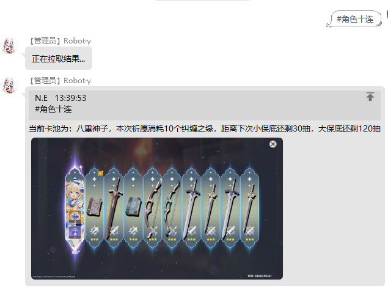

# 原神抽卡模拟


项目地址


如题。 之前逛Github的时候看到了一个很有意思的原神抽卡模拟项目，感觉很好，因此这里也给星尘部署上了。

API公开，如果想用的话可以联系我\~

### 可用指令:

**角色祈愿**

* \#角色\[十连/单抽]
* \#角色\[十连/单抽]2
* \#角色\[十连/单抽]3
* \#角色\[十连/单抽]...以此类推，编号未配置时会返回蛋池未配置提示

**武器/常驻祈愿**

* \#武器\[十连/单抽]
* \#常驻\[十连/单抽]

**武器定轨**

* \#定轨\[武器全称]

**查询指令**

* \#蛋池
* \#祈愿详情
* \#祈愿记录
* \#欧气排行

效果图：

.png>)

.png>)
